# TRAE CN Master Development Specification
## School Management System (SMS) — SMS-First, Laravel + MySQL + Cloudflare

**Document Status:** Master source of truth  
**Project Type:** Production-ready School Management System / School ERP  
**Build Priority:** School Management System first; public school website later  
**Primary Roles:** Super Admin, Admin, Teacher, Student, Parent  
**Backend:** Laravel 12 / PHP 8.4+  
**Database:** MySQL 8+  
**Frontend:** Blade + Livewire + Alpine.js + Tailwind CSS  
**API:** Laravel API + Sanctum  
**File Storage:** Cloudflare R2 via S3-compatible API  
**Edge / DNS / Security:** Cloudflare  
**Development IDE / AI:** TRAE CN / TRAE IDE  
**Version Control:** Git + GitHub  
**Staging:** Dedicated Cloudflare-backed `.dev` environment  
**Target Deployment:** Linux VPS or managed PHP/Laravel server behind Cloudflare

> **This document is the master engineering specification.** TRAE must read it before implementing any feature. When existing code or a new request conflicts with this document, TRAE must stop, identify the conflict, and propose the smallest explicit change. It must never silently invent architecture, permissions, data relationships, school information, grading rules, fees, or infrastructure.

---

# 1. Product Vision

Build a secure, modular, multi-role school management platform capable of supporting nursery, primary, junior secondary, and senior secondary operations while preserving academic, financial, admissions, attendance, communication, and administrative history across multiple academic sessions and terms.

The SMS is the immediate product. The public school website is deliberately deferred.

The initial application is:

```text
Authenticated School Portal
├── Super Admin
├── Admin
├── Teacher
├── Student
└── Parent
```

The public website will be a later layer that can consume approved public content from the SMS.

The system must be database-driven. School identity, statistics, fees, contacts, grading rules, sessions, terms, event information, and other school-specific values must never be hard-coded.

---

# 2. Non-Negotiable Architecture Decisions

## 2.1 Core stack

- PHP 8.4+
- Laravel 12
- MySQL 8+
- Blade
- Livewire
- Alpine.js
- Tailwind CSS
- Vite
- Laravel Sanctum
- Redis for production cache/queues
- Laravel Scheduler
- Laravel Notifications
- Laravel Filesystem using S3-compatible storage for Cloudflare R2
- Nginx + PHP-FPM in production

Use Laravel's standard conventions instead of creating a custom framework. [Laravel 12 documentation](https://laravel.com/framework/docs/12.x)

## 2.2 Database

**MySQL is the primary relational database.**

Do not redesign the core system around Cloudflare D1. The application's relational model, migrations, reporting, finance, academic history, and integrity constraints are designed for MySQL.

## 2.3 Cloudflare

Cloudflare sits in front of the Laravel origin and provides:

- DNS
- TLS/HTTPS
- Reverse proxying
- WAF
- DDoS protection
- Rate limiting where appropriate
- Performance features for safe static/public content

Do not use Cloudflare as a replacement for application authorization.

## 2.4 Cloudflare R2

Use R2 for object/file storage:

- Student photos
- Admission documents
- Assignment attachments
- Learning resources
- Report cards
- Receipts
- Event images
- Gallery images
- Exports and other generated files

R2 is accessed from Laravel using its S3-compatible API. [Cloudflare R2 API](https://developers.cloudflare.com/r2/api/)

## 2.5 TRAE

TRAE is the AI development environment, not the production runtime.

Keep project-wide instructions in:

```text
PROJECT_RULES.md
```

and detailed technical documents in:

```text
docs/
```

TRAE must implement the application incrementally by phase. Never ask it to generate the entire platform in one step.

## 2.6 Environment strategy

Three environments are required:

```text
LOCAL
  ↓
STAGING (.dev)
  ↓
PRODUCTION
```

### Local

```text
TRAE CN
→ Laravel
→ Local MySQL
→ Local Redis
```

### Staging

```text
GitHub
→ Staging server
→ Laravel
→ Staging MySQL
→ Staging R2
→ Cloudflare
→ https://<project>.dev
```

### Production

```text
GitHub main/release
→ Production server
→ Laravel
→ Production MySQL
→ Production R2
→ Cloudflare
→ Future production domain
```

**Never share production database credentials, R2 credentials, payment credentials, or real student documents with staging.**

## 2.7 Public website

The public website is not part of the initial SMS build.

Later production structure may be:

```text
www.example-school.com
    → public school website

portal.example-school.com
    → authenticated school management system

api.example-school.com
    → versioned API for mobile/integrations
```

---

# 3. Pre-Development Infrastructure Setup

Development should not begin until the core toolchain and staging pipeline are ready.

## 3.1 Accounts

- [ ] TRAE CN
- [ ] GitHub
- [ ] Cloudflare
- [ ] Domain registrar
- [ ] VPS/hosting provider
- [ ] Email provider (when needed)
- [ ] Payment provider (only when finance integration begins)

## 3.2 Local machine

- [ ] Git
- [ ] PHP 8.4+
- [ ] Composer
- [ ] Node.js
- [ ] npm
- [ ] MySQL 8+
- [ ] Redis
- [ ] TRAE CN

## 3.3 VPS

- [ ] Ubuntu/Linux
- [ ] Nginx
- [ ] PHP-FPM
- [ ] PHP extensions required by Laravel/packages
- [ ] MySQL or private managed MySQL
- [ ] Redis
- [ ] Composer
- [ ] Node.js/npm
- [ ] Git
- [ ] Supervisor/systemd
- [ ] Firewall
- [ ] Automatic security updates where appropriate
- [ ] Server backup/snapshot strategy

## 3.4 GitHub

- [ ] Private repository
- [ ] `main`
- [ ] `develop`
- [ ] Feature branches
- [ ] Branch protection
- [ ] Pull requests
- [ ] GitHub Actions
- [ ] Secret scanning/push protection where available
- [ ] `.env` ignored

## 3.5 Cloudflare

- [ ] Domain added
- [ ] DNS records verified
- [ ] Nameservers configured
- [ ] HTTPS configured
- [ ] Full (strict) TLS target
- [ ] WAF baseline
- [ ] Rate limiting
- [ ] `.dev` staging hostname
- [ ] R2 enabled
- [ ] Staging R2 bucket
- [ ] Production R2 bucket planned

Cloudflare's DNS setup requires reviewing DNS records and configuring the domain to use Cloudflare's nameservers. [Cloudflare DNS](https://developers.cloudflare.com/dns/get-started/)

## 3.6 First infrastructure milestone

Before building students or dashboards, prove:

```text
TRAE
  ↓
Laravel
  ↓
GitHub
  ↓
Staging server
  ↓
Cloudflare
  ↓
https://<project>.dev
```

Then prove:

```text
Laravel → MySQL
Laravel → Redis
Laravel → R2
```

Only after these work should feature development proceed.

---

# 4. Product Scope

The SMS will contain the following operational domains:

```text
Authentication
RBAC
School Settings
Academic Sessions
Terms
Students
Parents
Teachers
Staff foundation
Classes
Sections
Subjects
Teacher Assignments
Enrollments
Timetable
Attendance
Assignments
Resources
Examinations
Assessments
Results
Grading
Report Cards
Fees
Invoices
Payments
Receipts
Admissions
Announcements
Notifications
Messaging
Events
Gallery
Reports
Audit Logs
File Management
```

---

# 3. Core User Roles

## 3.1 Super Admin

Highest-level platform operator.

Capabilities:

- Manage all schools/tenants if multi-school support is enabled later
- Manage admins
- Manage roles and permissions
- View full audit logs
- Configure system-wide settings
- Configure school settings
- Manage integrations
- Manage storage
- Perform high-level reports
- Manage maintenance mode/system settings

For the first version, the system may operate as a single-school deployment, but the data model should keep a clean path toward multi-school expansion.

## 3.2 Admin

School administrator with broad school-level permissions.

Capabilities:

- Dashboard
- Students
- Parents
- Teachers/staff
- Admissions
- Classes/sections
- Subjects
- Academic sessions/terms
- Attendance reports
- Exams/results
- Report cards
- Fees/invoices/payments
- Timetable
- Assignments/resources oversight
- Announcements
- Events
- Gallery
- Reports
- School settings (limited by permission)
- Audit log viewing (limited by permission)

## 3.3 Teacher

Capabilities:

- Own profile
- Assigned classes
- Assigned subjects
- View timetable
- Mark attendance for permitted classes
- Create assignments
- Upload teaching resources
- Grade assignment submissions
- Enter assessment/exam scores
- Submit results for approval
- View announcements
- Communicate through approved messaging workflow
- View relevant student academic information only

Teachers must not see financial records unless explicitly granted a finance permission.

## 3.4 Student

Capabilities:

- Own profile
- Own enrollment
- View subjects
- View timetable
- View attendance
- View assignments
- Submit assignments where enabled
- View published results only
- View published report cards
- View school announcements
- Download permitted learning resources
- View fees/balance if enabled by school policy

Students must never access another student's data.

## 3.5 Parent

Capabilities:

- Manage/view own profile
- View linked children
- Switch between children
- View child's profile
- View attendance
- View assignments
- View timetable
- View published results
- View report cards
- View fees/invoices/payments/balance
- Download receipts
- Receive announcements/notifications
- View events
- Communicate with school/teachers where enabled
- Complete admissions applications for child/children

Parents must never access students not linked to their account.

---

# 4. Permission Model

Use RBAC with explicit permissions. Do not scatter role-name checks throughout controllers and views.

Example permissions:

```text
dashboard.view
school.settings.view
school.settings.update
users.view
users.create
users.update
users.delete
roles.view
roles.manage

students.view
students.create
students.update
students.delete
students.archive
students.export

parents.view
parents.create
parents.update
parents.link_children

teachers.view
teachers.create
teachers.update
teachers.delete

academic_sessions.view
academic_sessions.manage
terms.view
terms.manage
classes.view
classes.manage
sections.view
sections.manage
subjects.view
subjects.manage
class_subjects.manage
teacher_assignments.manage

enrollments.view
enrollments.create
enrollments.update

attendance.view
attendance.mark
attendance.update
attendance.approve
attendance.export

assignments.view
assignments.create
assignments.update
assignments.delete
submissions.view
submissions.grade
resources.view
resources.manage

exams.view
exams.create
exams.update
exam_results.view
exam_results.enter
exam_results.update
exam_results.submit
exam_results.approve
exam_results.publish
report_cards.view
report_cards.generate
report_cards.publish

fees.view
fees.manage_structure
invoices.view
invoices.create
invoices.update
payments.view
payments.record
payments.verify
payments.refund
receipts.view
receipts.generate
finance.export

admissions.view
admissions.create
admissions.update
admissions.review
admissions.approve
admissions.reject
admissions.documents.view
admissions.documents.manage

timetable.view
timetable.manage

announcements.view
announcements.create
announcements.update
announcements.publish
notifications.view
messages.view
messages.send

reports.view
reports.export
audit_logs.view
```

---

# 5. UX / UI Product Direction

The portal should feel like a modern SaaS application, not a basic CRUD admin template.

## 5.1 Layout

Desktop:

```text
--------------------------------------------------------------
| Logo | School / Session | Search | Notifications | Profile |
--------------------------------------------------------------
| Sidebar          | Main content                              |
|                  |                                           |
| Dashboard        | Page title / actions                     |
| Students         |                                           |
| Academics        | Cards / filters / tables / charts       |
| Attendance       |                                           |
| Finance          |                                           |
| Communication    |                                           |
| Reports          |                                           |
| Settings         |                                           |
--------------------------------------------------------------
```

Mobile:

- Collapsible sidebar
- Bottom/compact navigation only where useful
- Responsive tables with card fallback
- Touch-friendly form controls
- No horizontal overflow

## 5.2 Design rules

- Clean hierarchy
- Consistent spacing
- Accessible contrast
- Keyboard-friendly forms
- Clear empty states
- Skeleton/loading states where appropriate
- Clear success/error feedback
- Confirm destructive actions
- Avoid excessive animation
- Avoid dashboard clutter
- Use charts only where they support decisions

---

# 6. Admin Dashboard Requirements

Top KPI cards:

- Total students
- Total teachers
- Total parents
- Total classes
- Today's attendance rate
- Outstanding fees

Secondary sections:

- Admissions pipeline
- Today's attendance
- Fee collection summary
- Academic results awaiting approval
- Upcoming events
- Recent announcements
- Recent audit activity

Quick actions:

- Add student
- Add teacher
- Create class
- Record payment
- Create announcement
- Create exam

---

# 7. Teacher Dashboard Requirements

- My classes
- Today's timetable
- Attendance due today
- Pending assignments to grade
- Results awaiting completion
- Recent announcements
- Quick actions: mark attendance, create assignment, enter results

---

# 8. Student Dashboard Requirements

- Current class
- Today's timetable
- Attendance percentage
- Upcoming assignments
- Recent published results
- Latest announcements
- Current fees/balance if enabled
- Quick links to report card and resources

---

# 9. Parent Dashboard Requirements

- Child selector
- Children summary
- Attendance summary
- Results summary
- Fee balance
- Upcoming assignments
- Upcoming events
- Announcements
- Quick action: view invoice/pay fees/download receipt

A parent account can be linked to multiple students through a pivot table.

---

# 10. Functional Modules

## 10.1 Authentication & Account Security

- Login
- Logout
- Registration where enabled
- Forgot password
- Reset password
- Email verification where enabled
- Session management
- Optional 2FA-ready architecture
- Account status: active, suspended, archived
- Login throttling
- Strong password policy
- Secure session cookies
- Role-based redirect after authentication

Use Laravel's built-in authentication mechanisms. For API/mobile use cases, use Sanctum. Sanctum supports cookie-based SPA authentication and token authentication for APIs/mobile clients. [Laravel Sanctum](https://laravel.com/framework/docs/12.x/sanctum)

## 10.2 School Settings

Admin can configure:

- School name
- Logo
- Favicon
- Motto
- Address
- Phone
- Email
- Website
- Social media
- Principal/head details
- Mission
- Vision
- Core values
- Current academic session
- Current term
- Currency
- Timezone
- Attendance rules
- Grading rules
- Report-card template options
- Payment provider settings
- Notification settings

## 10.3 Student Management

Student profile:

- Student ID/admission number
- Full name
- Date of birth
- Gender
- Nationality (only if required)
- Address
- Photo
- Medical/emergency fields as required by school policy
- Admission data
- Enrollment history
- Current class/section
- House
- Status

Student lifecycle:

```text
Applicant -> Admitted -> Enrolled -> Active -> Graduated/Transferred/Withdrawn/Archived
```

Do not delete historical student records merely because a student leaves.

## 10.4 Parent Management

- Parent profile
- Contact details
- Emergency contact relationship
- Multiple-child links
- Primary/secondary guardian designation
- Preferred communication channel
- Account status

## 10.5 Teacher/Staff Management

Initial release needs teachers. The data model should allow future staff categories.

Teacher fields:

- Employee ID
- User account
- Full name
- Photo
- Email
- Phone
- Hire date
- Department (optional)
- Employment status
- Bio/qualifications (optional)

## 10.6 Academic Sessions and Terms

Academic session example:

```text
2026/2027
  First Term
  Second Term
  Third Term
```

Every term-sensitive record must reference the appropriate academic session and/or term.

Never overwrite previous academic history.

## 10.7 Classes and Sections

Examples:

```text
Primary 1
Primary 2
JSS 1
JSS 2
JSS 3
SS 1
SS 2
SS 3
```

Sections can be:

```text
A
B
C
```

## 10.8 Subjects

- Subject code
- Subject name
- Description
- Department/category
- Active status

## 10.9 Class Subjects and Teacher Assignments

- Map subject to class/section
- Assign one or more teachers
- Define academic session/term scope

## 10.10 Enrollment

A student's enrollment is term/session aware.

Track:

- Student
- Academic session
- Term (if needed)
- Class
- Section
- Enrollment date
- Status
- Roll number

## 10.11 Attendance

Attendance statuses:

```text
present
absent
late
excused
```

A daily record should store one status per student per attendance context.

Need:

- Mark attendance
- Edit attendance with permission
- Attendance reports
- Student percentage
- Class percentage
- Term/session history
- Parent notifications where configured

## 10.12 Timetable

Timetable records should support:

- Session
- Term
- Class/section
- Subject
- Teacher
- Room
- Day of week
- Start time
- End time

Prevent obvious conflicts:

- Same teacher in two classes at same time
- Same class in two subjects at same time
- Same room in two places at same time

## 10.13 Assignments

Assignment:

- Teacher
- Class/section
- Subject
- Title
- Instructions
- Due date
- Maximum score
- Attachment
- Publish date
- Status

Submission:

- Student
- Assignment
- File/text submission
- Submitted at
- Score
- Feedback
- Graded by
- Graded at

## 10.14 Resources

Teachers/admins can upload learning resources.

Examples:

- PDF notes
- Slides
- Handouts
- Images
- Reference files

Use R2 for object storage.

## 10.15 Exams and Results

Support multiple assessment types:

- CA/test
- Assignment
- Midterm
- Examination
- Practical
- Project

An exam can belong to a term and session.

Results must have workflow states:

```text
Draft -> Submitted -> Approved -> Published
```

Only published results are visible to students/parents unless explicit permission allows preview.

## 10.16 Grading System

Do not hard-code grades in controllers.

Create configurable grade rules, for example:

```text
70-100 = A
60-69  = B
50-59  = C
45-49  = D
40-44  = E
0-39   = F
```

The exact grading ranges must be editable by Admin.

## 10.17 Report Cards

Report cards contain:

- Student information
- Session
- Term
- Class
- Subject results
- Total score
- Average
- Grade
- Remark
- Attendance summary
- Teacher remark
- Principal/head remark
- Signature placeholders

Actions:

- Generate
- Preview
- Publish
- Download PDF
- Print

## 10.18 Finance / Fees

Finance supports:

- Fee structure
- Fee items
- Invoices
- Payments
- Receipts
- Outstanding balances
- Payment verification
- Refunds (permission controlled)
- Financial reports

Example fee items:

```text
Tuition
Development Levy
Books
Uniform
Examination
Transportation
Sports
ICT
Other
```

The fee structure must be session/term/class aware.

## 10.19 Payments

Payment statuses:

```text
pending
successful
failed
cancelled
refunded
```

Payment channels:

```text
cash
bank_transfer
card
online
other
```

Online payment integration must be abstracted behind a payment service interface so the school can change providers later.

Never store raw card details.

## 10.20 Admissions

Recommended workflow:

```text
Applicant account
  -> Child profile
  -> Application form
  -> Document upload
  -> Application fee
  -> Review
  -> Assessment/interview
  -> Decision
  -> Offer
  -> Acceptance
  -> Enrollment
```

Application statuses:

```text
draft
submitted
under_review
assessment
interview
accepted
rejected
waitlisted
withdrawn
enrolled
```

## 10.21 Announcements

Support targeted audiences:

- All
- Parents
- Students
- Teachers
- Specific class
- Specific section

Status:

```text
draft
scheduled
published
archived
```

## 10.22 Notifications

Channels can include:

- In-app/database
- Email
- Future SMS/WhatsApp integration

Use queues for non-critical notification delivery.

## 10.23 Messaging

Start with controlled school-to-parent / teacher-to-parent / admin messaging.

Do not implement unrestricted social-chat behavior in MVP.

Messages should support:

- sender
- recipient
- subject
- body
- read status
- timestamps
- optional attachments

## 10.24 Events

Event fields:

- title
- slug
- description
- start date/time
- end date/time
- venue
- cover image
- audience
- status

## 10.25 Gallery

Structure:

```text
Album
  -> many images
```

Images should be stored in R2.

## 10.26 Reports

Initial reports:

- Student list
- Enrollment by class
- Attendance by class/student
- Fee collection
- Outstanding balances
- Payment ledger
- Results by subject
- Results by class
- Admissions pipeline
- Teacher workload

Support CSV export initially and PDF export where useful.

## 10.27 Audit Logs

Record security-sensitive and material administrative operations.

Example:

```text
user: 123
action: exam_result.updated
entity: ExamResult
entity_id: 888
old_values: {...}
new_values: {...}
ip_address: ...
user_agent: ...
created_at: ...
```

Audit logs should be append-only to normal application users.

---

# 11. Complete MySQL Data Model

## 11.1 Naming conventions

- Table names: plural snake_case
- Primary keys: `id` BIGINT UNSIGNED
- Foreign keys: `<singular_table>_id`
- Timestamps: `created_at`, `updated_at`
- Soft delete only where appropriate
- Use indexes for foreign keys and common filters
- Use unique constraints for business identifiers where appropriate
- Use `DECIMAL(15,2)` for money
- Store timestamps in UTC where practical and convert for display based on school timezone

## 11.2 Core tables

### users

```text
id
role_id
name
email
phone
password
status
email_verified_at
last_login_at
remember_token
created_at
updated_at
```

### roles

```text
id
name
slug
description
created_at
updated_at
```

### permissions

```text
id
name
slug
description
created_at
updated_at
```

### role_permissions

```text
id
role_id
permission_id
created_at
updated_at
UNIQUE(role_id, permission_id)
```

## 11.3 Staff/identity tables

### teachers

```text
id
user_id
employee_id
first_name
last_name
middle_name
gender
date_of_birth
phone
address
photo_path
hire_date
department
employment_status
bio
created_at
updated_at
```

### parents

```text
id
user_id
parent_code
first_name
last_name
middle_name
relationship_default
phone
email
address
occupation
photo_path
created_at
updated_at
```

### students

```text
id
user_id nullable
student_code
admission_number
first_name
last_name
middle_name
gender
date_of_birth
address
photo_path
admission_date
house
blood_group nullable
status
notes nullable
created_at
updated_at
deleted_at nullable
```

A student account can be optional for younger learners. The `user_id` may be null until an account is created.

### student_parents

```text
id
student_id
parent_id
relationship
is_primary
can_pickup
created_at
updated_at
UNIQUE(student_id, parent_id)
```

## 11.4 Academic structure

### academic_sessions

```text
id
name              -- e.g. 2026/2027
starts_on
ends_on
status             -- planned/active/closed
created_at
updated_at
```

### terms

```text
id
academic_session_id
name              -- First Term, Second Term, Third Term
sequence
starts_on
ends_on
status             -- planned/active/closed
created_at
updated_at
UNIQUE(academic_session_id, sequence)
```

### classes

```text
id
name              -- JSS 1
code
level_category    -- nursery/primary/junior_secondary/senior_secondary
class_teacher_id nullable
is_active
created_at
updated_at
```

### sections

```text
id
class_id
name              -- A/B/C
capacity nullable
is_active
created_at
updated_at
UNIQUE(class_id, name)
```

### subjects

```text
id
name
code
description nullable
department nullable
is_core
is_active
created_at
updated_at
UNIQUE(code)
```

### class_subjects

```text
id
class_id
section_id nullable
subject_id
academic_session_id
created_at
updated_at
UNIQUE(class_id, section_id, subject_id, academic_session_id)
```

### teacher_subject_assignments

```text
id
teacher_id
class_subject_id
term_id nullable
created_at
updated_at
UNIQUE(teacher_id, class_subject_id, term_id)
```

### enrollments

```text
id
student_id
academic_session_id
term_id nullable
class_id
section_id nullable
roll_number nullable
enrollment_date
status
created_at
updated_at
UNIQUE(student_id, academic_session_id, term_id)
```

For annual enrollment plus term-specific movement, adjust the unique rule only if school policy requires mid-year section transitions.

## 11.5 Attendance

### attendance_sessions

```text
id
academic_session_id
term_id
attendance_date
class_id
section_id nullable
recorded_by
status           -- draft/submitted/approved
created_at
updated_at
UNIQUE(attendance_date, class_id, section_id)
```

### attendance_records

```text
id
attendance_session_id
student_id
status           -- present/absent/late/excused
remarks nullable
created_at
updated_at
UNIQUE(attendance_session_id, student_id)
```

## 11.6 Timetable

### timetable_entries

```text
id
academic_session_id
term_id
class_id
section_id nullable
subject_id
teacher_id
room nullable
day_of_week      -- 1-7
starts_at
ends_at
created_at
updated_at
```

## 11.7 Assignments

### assignments

```text
id
teacher_id
class_id
section_id nullable
subject_id
term_id
title
slug
instructions nullable
max_score
due_at
publish_at nullable
status            -- draft/published/closed
created_at
updated_at
```

### assignment_attachments

```text
id
assignment_id
file_name
file_path
mime_type
file_size
created_at
updated_at
```

### assignment_submissions

```text
id
assignment_id
student_id
submission_text nullable
submitted_at nullable
status           -- draft/submitted/late/graded
score nullable
feedback nullable
graded_by nullable
graded_at nullable
created_at
updated_at
UNIQUE(assignment_id, student_id)
```

### submission_attachments

```text
id
assignment_submission_id
file_name
file_path
mime_type
file_size
created_at
updated_at
```

## 11.8 Exams/results

### exam_types

```text
id
name
code
weight nullable
is_active
created_at
updated_at
```

### exams

```text
id
academic_session_id
term_id
exam_type_id
name
starts_on
ends_on
status           -- draft/open/closed
created_at
updated_at
```

### exam_subjects

```text
id
exam_id
class_id
section_id nullable
subject_id
max_score
weight
created_at
updated_at
UNIQUE(exam_id, class_id, section_id, subject_id)
```

### exam_results

```text
id
exam_subject_id
student_id
score
remark nullable
status           -- draft/submitted/approved/published
entered_by
submitted_at nullable
approved_by nullable
approved_at nullable
published_at nullable
created_at
updated_at
UNIQUE(exam_subject_id, student_id)
```

### grade_rules

```text
id
name
min_score
max_score
grade
remark nullable
priority
is_active
created_at
updated_at
```

### report_cards

```text
id
student_id
academic_session_id
term_id
enrollment_id
average_score nullable
position nullable
attendance_percentage nullable
teacher_remark nullable
principal_remark nullable
status            -- draft/generated/published
published_at nullable
generated_by
created_at
updated_at
UNIQUE(student_id, term_id)
```

### report_card_items

```text
id
report_card_id
subject_id
ca_score nullable
exam_score nullable
total_score nullable
grade nullable
remark nullable
created_at
updated_at
UNIQUE(report_card_id, subject_id)
```

## 11.9 Finance

### fee_structures

```text
id
academic_session_id
term_id
class_id
name
status             -- draft/active/closed
created_at
updated_at
```

### fee_items

```text
id
fee_structure_id
name
code
amount
is_optional
created_at
updated_at
```

### student_invoices

```text
id
student_id
academic_session_id
term_id
invoice_number
issue_date
due_date
subtotal
discount_amount
tax_amount
total_amount
amount_paid
balance_due
status             -- draft/issued/partially_paid/paid/overdue/cancelled
created_at
updated_at
UNIQUE(invoice_number)
```

### student_invoice_items

```text
id
student_invoice_id
fee_item_id nullable
description
amount
created_at
updated_at
```

### payments

```text
id
student_invoice_id nullable
student_id
payment_reference
provider_reference nullable
amount
currency
payment_method
status
paid_at nullable
received_by nullable
metadata JSON nullable
created_at
updated_at
UNIQUE(payment_reference)
```

### payment_receipts

```text
id
payment_id
receipt_number
issued_at
file_path nullable
created_at
updated_at
UNIQUE(receipt_number)
```

### payment_refunds

```text
id
payment_id
amount
reason
status
processed_by
processed_at nullable
created_at
updated_at
```

## 11.10 Admissions

### admissions

```text
id
application_number
parent_id
student_id nullable
academic_session_id
applying_for_class_id
applying_for_section_id nullable
status
submitted_at nullable
reviewed_by nullable
reviewed_at nullable
decision_reason nullable
created_at
updated_at
UNIQUE(application_number)
```

### admission_applications

```text
id
admission_id
child_first_name
child_last_name
child_middle_name
gender
date_of_birth
previous_school nullable
previous_class nullable
address
additional_notes nullable
created_at
updated_at
```

### admission_documents

```text
id
admission_id
document_type
file_name
file_path
mime_type
file_size
verification_status -- pending/verified/rejected
verified_by nullable
verified_at nullable
created_at
updated_at
```

### admission_assessments

```text
id
admission_id
assessment_type
scheduled_at nullable
score nullable
remarks nullable
assessed_by nullable
status
created_at
updated_at
```

## 11.11 Communication

### announcements

```text
id
created_by
title
slug
body
audience_type
class_id nullable
section_id nullable
publish_at nullable
expires_at nullable
status
created_at
updated_at
```

### announcement_recipients

```text
id
announcement_id
user_id
read_at nullable
created_at
updated_at
UNIQUE(announcement_id, user_id)
```

### notifications

Laravel's notification system may manage the `notifications` table. Use database notifications for in-app alerts.

### messages

```text
id
sender_id
subject
body
created_at
updated_at
```

### message_recipients

```text
id
message_id
recipient_id
read_at nullable
created_at
updated_at
UNIQUE(message_id, recipient_id)
```

## 11.12 Events/gallery

### events

```text
id
created_by
title
slug
description
starts_at
ends_at nullable
venue nullable
cover_image_path nullable
audience_type
status
created_at
updated_at
```

### gallery_albums

```text
id
created_by
title
slug
description nullable
category nullable
cover_image_path nullable
published_at nullable
status
created_at
updated_at
```

### gallery_images

```text
id
gallery_album_id
file_name
file_path
caption nullable
sort_order
taken_at nullable
created_at
updated_at
```

## 11.13 System/admin

### school_settings

```text
id
key
value
value_type
created_at
updated_at
UNIQUE(key)
```

### audit_logs

```text
id
user_id nullable
action
entity_type
entity_id nullable
old_values JSON nullable
new_values JSON nullable
ip_address nullable
user_agent nullable
created_at
```

### file_uploads (optional but recommended)

A generic file registry can make R2 cleanup and audit easier.

```text
id
uploaded_by
storage_disk
file_path
original_name
mime_type
file_size
visibility
purpose nullable
created_at
updated_at
```

---

# 12. ERD

The following high-level ERD represents the principal relationships. Use the actual foreign keys from the schema above when generating migrations.

```mermaid
erDiagram
    USERS ||--o{ STUDENTS : "optional account"
    USERS ||--o| TEACHERS : "owns"
    USERS ||--o| PARENTS : "owns"
    ROLES ||--o{ USERS : "assigned"
    ROLES ||--o{ ROLE_PERMISSIONS : "has"
    PERMISSIONS ||--o{ ROLE_PERMISSIONS : "granted"

    STUDENTS ||--o{ STUDENT_PARENTS : linked
    PARENTS ||--o{ STUDENT_PARENTS : linked

    ACADEMIC_SESSIONS ||--o{ TERMS : contains
    ACADEMIC_SESSIONS ||--o{ ENROLLMENTS : scopes
    TERMS ||--o{ ENROLLMENTS : scopes
    CLASSES ||--o{ SECTIONS : contains
    CLASSES ||--o{ CLASS_SUBJECTS : offers
    SUBJECTS ||--o{ CLASS_SUBJECTS : mapped
    ACADEMIC_SESSIONS ||--o{ CLASS_SUBJECTS : scopes
    TEACHERS ||--o{ TEACHER_SUBJECT_ASSIGNMENTS : teaches
    CLASS_SUBJECTS ||--o{ TEACHER_SUBJECT_ASSIGNMENTS : assigned

    STUDENTS ||--o{ ENROLLMENTS : has
    CLASSES ||--o{ ENROLLMENTS : contains
    SECTIONS ||--o{ ENROLLMENTS : contains

    ATTENDANCE_SESSIONS ||--o{ ATTENDANCE_RECORDS : contains
    STUDENTS ||--o{ ATTENDANCE_RECORDS : receives

    ASSIGNMENTS ||--o{ ASSIGNMENT_SUBMISSIONS : receives
    STUDENTS ||--o{ ASSIGNMENT_SUBMISSIONS : submits
    TEACHERS ||--o{ ASSIGNMENTS : creates

    EXAMS ||--o{ EXAM_SUBJECTS : contains
    EXAM_SUBJECTS ||--o{ EXAM_RESULTS : records
    STUDENTS ||--o{ EXAM_RESULTS : receives
    EXAM_TYPES ||--o{ EXAMS : classifies
    GRADE_RULES ||--o{ REPORT_CARD_ITEMS : "applies conceptually"

    REPORT_CARDS ||--o{ REPORT_CARD_ITEMS : contains
    STUDENTS ||--o{ REPORT_CARDS : receives
    SUBJECTS ||--o{ REPORT_CARD_ITEMS : grades

    FEE_STRUCTURES ||--o{ FEE_ITEMS : contains
    STUDENTS ||--o{ STUDENT_INVOICES : billed
    STUDENT_INVOICES ||--o{ STUDENT_INVOICE_ITEMS : contains
    STUDENT_INVOICES ||--o{ PAYMENTS : paid_by
    PAYMENTS ||--o| PAYMENT_RECEIPTS : generates
    PAYMENTS ||--o{ PAYMENT_REFUNDS : may_have

    PARENTS ||--o{ ADMISSIONS : submits
    ADMISSIONS ||--o| ADMISSION_APPLICATIONS : details
    ADMISSIONS ||--o{ ADMISSION_DOCUMENTS : includes
    ADMISSIONS ||--o{ ADMISSION_ASSESSMENTS : has

    ANNOUNCEMENTS ||--o{ ANNOUNCEMENT_RECIPIENTS : targets
    USERS ||--o{ ANNOUNCEMENT_RECIPIENTS : receives
    MESSAGES ||--o{ MESSAGE_RECIPIENTS : targets
    USERS ||--o{ MESSAGE_RECIPIENTS : receives

    GALLERY_ALBUMS ||--o{ GALLERY_IMAGES : contains
```



---

# 13. Laravel Project Folder Structure

Use Laravel 12 as the base structure, then extend it carefully.

```text
school-management-system/
├── app/
│   ├── Console/
│   │   └── Commands/
│   ├── Enums/
│   │   ├── AdmissionStatus.php
│   │   ├── AttendanceStatus.php
│   │   ├── EnrollmentStatus.php
│   │   ├── InvoiceStatus.php
│   │   ├── PaymentStatus.php
│   │   ├── ResultStatus.php
│   │   └── UserStatus.php
│   ├── Events/
│   ├── Exceptions/
│   ├── Http/
│   │   ├── Controllers/
│   │   │   ├── Api/
│   │   │   │   └── V1/
│   │   │   │       ├── Auth/
│   │   │   │       ├── Admin/
│   │   │   │       ├── Teacher/
│   │   │   │       ├── Student/
│   │   │   │       ├── Parent/
│   │   │   │       └── Shared/
│   │   │   ├── Admin/
│   │   │   ├── Teacher/
│   │   │   ├── Student/
│   │   │   ├── Parent/
│   │   │   └── Public/
│   │   ├── Middleware/
│   │   └── Requests/
│   │       ├── Admin/
│   │       ├── Teacher/
│   │       ├── Student/
│   │       ├── Parent/
│   │       ├── Auth/
│   │       └── Shared/
│   ├── Jobs/
│   ├── Listeners/
│   ├── Mail/
│   ├── Models/
│   │   ├── AcademicSession.php
│   │   ├── Admission.php
│   │   ├── AdmissionApplication.php
│   │   ├── AdmissionAssessment.php
│   │   ├── AdmissionDocument.php
│   │   ├── Announcement.php
│   │   ├── AnnouncementRecipient.php
│   │   ├── Assignment.php
│   │   ├── AssignmentAttachment.php
│   │   ├── AssignmentSubmission.php
│   │   ├── AttendanceRecord.php
│   │   ├── AttendanceSession.php
│   │   ├── AuditLog.php
│   │   ├── ClassModel.php
│   │   ├── ClassSubject.php
│   │   ├── Enrollment.php
│   │   ├── Exam.php
│   │   ├── ExamResult.php
│   │   ├── ExamSubject.php
│   │   ├── ExamType.php
│   │   ├── FeeItem.php
│   │   ├── FeeStructure.php
│   │   ├── GalleryAlbum.php
│   │   ├── GalleryImage.php
│   │   ├── GradeRule.php
│   │   ├── Message.php
│   │   ├── MessageRecipient.php
│   │   ├── ParentModel.php
│   │   ├── Payment.php
│   │   ├── PaymentReceipt.php
│   │   ├── PaymentRefund.php
│   │   ├── Permission.php
│   │   ├── ReportCard.php
│   │   ├── ReportCardItem.php
│   │   ├── Role.php
│   │   ├── Section.php
│   │   ├── Student.php
│   │   ├── StudentInvoice.php
│   │   ├── StudentInvoiceItem.php
│   │   ├── Subject.php
│   │   ├── Teacher.php
│   │   ├── TeacherSubjectAssignment.php
│   │   ├── Term.php
│   │   ├── TimetableEntry.php
│   │   ├── User.php
│   │   └── SchoolSetting.php
│   ├── Notifications/
│   ├── Policies/
│   │   ├── StudentPolicy.php
│   │   ├── AttendancePolicy.php
│   │   ├── AssignmentPolicy.php
│   │   ├── ResultPolicy.php
│   │   ├── FeePolicy.php
│   │   ├── AdmissionPolicy.php
│   │   └── AnnouncementPolicy.php
│   ├── Providers/
│   ├── Rules/
│   ├── Services/
│   │   ├── Auth/
│   │   ├── Academic/
│   │   ├── Attendance/
│   │   ├── Admissions/
│   │   ├── Finance/
│   │   ├── Results/
│   │   ├── Reports/
│   │   ├── Storage/
│   │   └── Notifications/
│   └── Support/
│       ├── Helpers/
│       ├── DTOs/
│       └── Concerns/
├── bootstrap/
├── config/
│   ├── auth.php
│   ├── filesystems.php
│   ├── services.php
│   ├── school.php
│   └── ...
├── database/
│   ├── factories/
│   ├── migrations/
│   └── seeders/
│       ├── DatabaseSeeder.php
│       ├── RolePermissionSeeder.php
│       ├── AcademicDemoSeeder.php
│       └── DemoUserSeeder.php
├── docs/
│   ├── ARCHITECTURE.md
│   ├── DATABASE.md
│   ├── API.md
│   ├── SECURITY.md
│   ├── DEPLOYMENT.md
│   ├── UI_GUIDE.md
│   ├── MODULES.md
│   └── ADR/
├── public/
├── resources/
│   ├── css/
│   ├── js/
│   └── views/
│       ├── layouts/
│       ├── components/
│       ├── public/
│       ├── auth/
│       ├── admin/
│       ├── teacher/
│       ├── student/
│       └── parent/
├── routes/
│   ├── web.php
│   ├── api.php
│   ├── channels.php
│   └── console.php
├── storage/
├── tests/
│   ├── Feature/
│   │   ├── Auth/
│   │   ├── Admin/
│   │   ├── Teacher/
│   │   ├── Student/
│   │   ├── Parent/
│   │   ├── Finance/
│   │   ├── Admissions/
│   │   └── API/
│   └── Unit/
├── .env.example
├── project_rules.md
├── README.md
├── composer.json
├── package.json
└── vite.config.js
```

Avoid naming a model `Class.php` because `Class` is a PHP language keyword/concept. Use `ClassModel.php` mapped to the `classes` table, or use a more domain-specific name such as `SchoolClass.php`.

---

# 14. Service Layer Rules

Controllers should coordinate HTTP concerns only.

Complex business logic belongs in services.

Examples:

```text
StudentEnrollmentService
AttendanceService
AssignmentGradingService
ExamResultService
ReportCardService
InvoiceService
PaymentService
AdmissionService
R2StorageService
NotificationService
```

Example flow:

```text
Controller
  -> Form Request validation
  -> Policy authorization
  -> Domain/Service action
  -> Model/database transaction
  -> Event/Notification/Job
  -> Response/redirect
```

Use database transactions for multi-write operations such as:

- Generating an invoice and invoice items
- Publishing results
- Generating report cards
- Recording a payment and receipt
- Enrolling students
- Admission conversion into a student record

---

# 15. Migrations: Exact Creation Order

Create migrations in dependency order.

1. users
2. roles
3. permissions
4. role_permissions
5. academic_sessions
6. terms
7. classes
8. sections
9. subjects
10. school_settings
11. teachers
12. parents
13. students
14. student_parents
15. class_subjects
16. teacher_subject_assignments
17. enrollments
18. attendance_sessions
19. attendance_records
20. timetable_entries
21. assignments
22. assignment_attachments
23. assignment_submissions
24. submission_attachments
25. exam_types
26. exams
27. exam_subjects
28. grade_rules
29. exam_results
30. report_cards
31. report_card_items
32. fee_structures
33. fee_items
34. student_invoices
35. student_invoice_items
36. payments
37. payment_receipts
38. payment_refunds
39. admissions
40. admission_applications
41. admission_documents
42. admission_assessments
43. announcements
44. announcement_recipients
45. messages
46. message_recipients
47. events
48. gallery_albums
49. gallery_images
50. audit_logs
51. file_uploads
52. framework/system tables required by installed packages

Every foreign key must reference an existing table at the time the migration runs.

Run:

```bash
php artisan migrate
php artisan migrate:fresh --seed
```

only in local development/testing environments as appropriate.

---

# 16. Seed Data

Create deterministic demo data for development.

Default seeded roles:

```text
Super Admin
Admin
Teacher
Student
Parent
```

Seed permissions and map them to roles.

Seed:

- 1 school configuration
- 1 active academic session
- 3 terms
- sample classes
- sample sections
- sample subjects
- sample teachers
- sample parents
- sample students
- sample enrollments
- sample attendance
- sample assignments
- sample exams/results
- sample fees/invoices/payments
- sample announcements
- sample events

Credentials must be documented only as local-development demo credentials and must never be used in production.

---

# 17. API Strategy

API prefix:

```text
/api/v1
```

Use JSON consistently.

Recommended response envelope:

```json
{
  "success": true,
  "message": "Students retrieved successfully.",
  "data": {},
  "meta": {}
}
```

Validation failures:

```json
{
  "success": false,
  "message": "Validation failed.",
  "errors": {
    "email": ["The email field is required."]
  }
}
```

Use correct HTTP status codes:

- 200 success
- 201 created
- 204 deleted/no content where appropriate
- 400 bad request
- 401 unauthenticated
- 403 unauthorized
- 404 not found
- 409 conflict
- 422 validation failure
- 429 rate limited
- 500 server error

Pagination format:

```text
GET /api/v1/students?page=1&per_page=20&search=john
```

Do not return passwords, password hashes, secrets, private file keys, or security-sensitive fields.

---

# 18. API Endpoints

## 18.1 Authentication

```text
POST   /api/v1/auth/login
POST   /api/v1/auth/logout
GET    /api/v1/auth/me
POST   /api/v1/auth/forgot-password
POST   /api/v1/auth/reset-password
POST   /api/v1/auth/verify-email
```

For first-party SPA/browser use, prefer session/cookie authentication. Use Sanctum token abilities for external/mobile clients where needed. [Laravel Sanctum](https://laravel.com/framework/docs/12.x/sanctum)

## 18.2 Dashboard

```text
GET /api/v1/dashboard
GET /api/v1/dashboard/admin
GET /api/v1/dashboard/teacher
GET /api/v1/dashboard/student
GET /api/v1/dashboard/parent
```

## 18.3 Students

```text
GET    /api/v1/students
POST   /api/v1/students
GET    /api/v1/students/{student}
PUT    /api/v1/students/{student}
DELETE /api/v1/students/{student}
POST   /api/v1/students/{student}/archive
GET    /api/v1/students/{student}/enrollments
GET    /api/v1/students/{student}/attendance
GET    /api/v1/students/{student}/results
GET    /api/v1/students/{student}/report-cards
```

## 18.4 Parents

```text
GET    /api/v1/parents
POST   /api/v1/parents
GET    /api/v1/parents/{parent}
PUT    /api/v1/parents/{parent}
GET    /api/v1/parents/{parent}/children
POST   /api/v1/parents/{parent}/children
DELETE /api/v1/parents/{parent}/children/{student}
```

## 18.5 Teachers

```text
GET    /api/v1/teachers
POST   /api/v1/teachers
GET    /api/v1/teachers/{teacher}
PUT    /api/v1/teachers/{teacher}
DELETE /api/v1/teachers/{teacher}
GET    /api/v1/teachers/{teacher}/classes
GET    /api/v1/teachers/{teacher}/subjects
```

## 18.6 Academic Sessions/Terms

```text
GET    /api/v1/academic-sessions
POST   /api/v1/academic-sessions
GET    /api/v1/academic-sessions/{session}
PUT    /api/v1/academic-sessions/{session}
POST   /api/v1/academic-sessions/{session}/activate
POST   /api/v1/academic-sessions/{session}/close

GET    /api/v1/terms
POST   /api/v1/terms
GET    /api/v1/terms/{term}
PUT    /api/v1/terms/{term}
POST   /api/v1/terms/{term}/activate
POST   /api/v1/terms/{term}/close
```

## 18.7 Classes/Sections/Subjects

```text
GET    /api/v1/classes
POST   /api/v1/classes
GET    /api/v1/classes/{class}
PUT    /api/v1/classes/{class}
DELETE /api/v1/classes/{class}

GET    /api/v1/classes/{class}/sections
POST   /api/v1/classes/{class}/sections
PUT    /api/v1/sections/{section}
DELETE /api/v1/sections/{section}

GET    /api/v1/subjects
POST   /api/v1/subjects
GET    /api/v1/subjects/{subject}
PUT    /api/v1/subjects/{subject}
DELETE /api/v1/subjects/{subject}
```

## 18.8 Enrollments

```text
GET  /api/v1/enrollments
POST /api/v1/enrollments
GET  /api/v1/enrollments/{enrollment}
PUT  /api/v1/enrollments/{enrollment}
```

## 18.9 Attendance

```text
GET  /api/v1/attendance/sessions
POST /api/v1/attendance/sessions
GET  /api/v1/attendance/sessions/{attendanceSession}
PUT  /api/v1/attendance/sessions/{attendanceSession}
POST /api/v1/attendance/sessions/{attendanceSession}/submit
POST /api/v1/attendance/sessions/{attendanceSession}/approve
GET  /api/v1/attendance/students/{student}
GET  /api/v1/attendance/classes/{class}
```

## 18.10 Assignments

```text
GET    /api/v1/assignments
POST   /api/v1/assignments
GET    /api/v1/assignments/{assignment}
PUT    /api/v1/assignments/{assignment}
DELETE /api/v1/assignments/{assignment}
POST   /api/v1/assignments/{assignment}/publish
GET    /api/v1/assignments/{assignment}/submissions
POST   /api/v1/assignments/{assignment}/submissions
PUT    /api/v1/submissions/{submission}/grade
```

## 18.11 Exams/Results

```text
GET  /api/v1/exam-types
POST /api/v1/exam-types
GET  /api/v1/exams
POST /api/v1/exams
GET  /api/v1/exams/{exam}
PUT  /api/v1/exams/{exam}
POST /api/v1/exams/{exam}/open
POST /api/v1/exams/{exam}/close

GET  /api/v1/exam-subjects/{examSubject}/results
PUT  /api/v1/exam-results/{examResult}
POST /api/v1/exam-results/{examResult}/submit
POST /api/v1/exam-results/{examResult}/approve
POST /api/v1/exam-results/{examResult}/publish
GET  /api/v1/students/{student}/results
GET  /api/v1/students/{student}/report-cards
```

## 18.12 Finance

```text
GET  /api/v1/fee-structures
POST /api/v1/fee-structures
GET  /api/v1/fee-structures/{feeStructure}
PUT  /api/v1/fee-structures/{feeStructure}

GET  /api/v1/invoices
POST /api/v1/invoices
GET  /api/v1/invoices/{invoice}
PUT  /api/v1/invoices/{invoice}

GET  /api/v1/payments
POST /api/v1/payments
GET  /api/v1/payments/{payment}
POST /api/v1/payments/{payment}/verify
POST /api/v1/payments/{payment}/refund
GET  /api/v1/payments/{payment}/receipt

GET /api/v1/finance/outstanding
GET /api/v1/finance/summary
```

## 18.13 Admissions

```text
GET  /api/v1/admissions
POST /api/v1/admissions
GET  /api/v1/admissions/{admission}
PUT  /api/v1/admissions/{admission}
POST /api/v1/admissions/{admission}/submit
POST /api/v1/admissions/{admission}/review
POST /api/v1/admissions/{admission}/accept
POST /api/v1/admissions/{admission}/reject
POST /api/v1/admissions/{admission}/withdraw
POST /api/v1/admissions/{admission}/documents
POST /api/v1/admissions/{admission}/assessments
```

## 18.14 Timetable

```text
GET    /api/v1/timetable
POST   /api/v1/timetable
GET    /api/v1/timetable/{entry}
PUT    /api/v1/timetable/{entry}
DELETE /api/v1/timetable/{entry}
```

## 18.15 Announcements/messages/events/gallery

```text
GET    /api/v1/announcements
POST   /api/v1/announcements
GET    /api/v1/announcements/{announcement}
PUT    /api/v1/announcements/{announcement}
POST   /api/v1/announcements/{announcement}/publish

GET    /api/v1/messages
POST   /api/v1/messages
GET    /api/v1/messages/{message}
POST   /api/v1/messages/{message}/read

GET    /api/v1/events
POST   /api/v1/events
GET    /api/v1/events/{event}
PUT    /api/v1/events/{event}
DELETE /api/v1/events/{event}

GET    /api/v1/gallery/albums
POST   /api/v1/gallery/albums
GET    /api/v1/gallery/albums/{album}
PUT    /api/v1/gallery/albums/{album}
POST   /api/v1/gallery/albums/{album}/images
DELETE /api/v1/gallery/images/{image}
```

## 18.16 Settings/reports/audit

```text
GET /api/v1/settings/school
PUT /api/v1/settings/school

GET /api/v1/reports/students
GET /api/v1/reports/attendance
GET /api/v1/reports/results
GET /api/v1/reports/finance
GET /api/v1/reports/admissions
GET /api/v1/audit-logs
```

---

# 19. API Authorization Rules

Every endpoint must have all applicable layers:

1. Authentication
2. Role/permission authorization
3. Resource-level policy check
4. Ownership/scope check
5. Input validation

Example:

```text
Parent requests student 42 results
   -> authenticated?
   -> has parent.results.view?
   -> student 42 linked to authenticated parent?
   -> result is published?
   -> return data
```

Do not authorize a parent merely because they possess a student ID in the URL.

---

# 20. Cloudflare Configuration

## 20.1 DNS

Create DNS records for the origin server and application domains.

Recommended:

```text
A     @       -> ORIGIN_IPV4
A     www     -> ORIGIN_IPV4
A     portal  -> ORIGIN_IPV4
```

For API:

```text
A     api     -> ORIGIN_IPV4
```

Proxy the public application records through Cloudflare where appropriate.

Do not expose the origin IP publicly if your deployment architecture allows a protected/private origin path.

## 20.2 SSL/TLS

Use HTTPS only.

Preferred Cloudflare mode:

```text
Full (strict)
```

Install a valid certificate on the origin.

Do not use Flexible SSL for production.

## 20.3 WAF

Enable appropriate managed protections.

Use custom rules to protect:

- login
- password reset
- admin routes
- API routes
- file upload endpoints

Do not create broad WAF rules that block legitimate school users.

## 20.4 Rate Limiting

Rate-limit sensitive endpoints:

```text
/login
/forgot-password
/api/v1/auth/*
/payment webhook endpoints where appropriate
```

Also keep Laravel application-level throttling enabled.

## 20.5 Caching

Cache public/static assets aggressively.

Do not cache authenticated dashboard responses at the CDN unless a deliberate private caching strategy exists.

Never cache:

- student private data
- parent private data
- payment data
- authenticated API JSON
- report card private pages

## 20.6 Cloudflare Webhooks / payment callbacks

Payment webhook endpoints must:

- Verify provider signature
- Be idempotent
- Log received references safely
- Never trust the amount supplied by the browser
- Reconcile payment amount with server-side invoice data

---

# 21. Cloudflare R2 Integration

## 21.1 Use cases

Store large/unstructured objects in R2:

- Student photos
- Admission documents
- Assignment attachments
- Submission attachments
- Teacher resources
- Report card PDFs
- Payment receipt PDFs
- Event images
- Gallery images

## 21.2 R2 Laravel filesystem

Use Laravel's S3-compatible filesystem configuration.

`config/filesystems.php` should contain an R2 disk conceptually similar to:

```php
'r2' => [
    'driver' => 's3',
    'key' => env('AWS_ACCESS_KEY_ID'),
    'secret' => env('AWS_SECRET_ACCESS_KEY'),
    'region' => env('AWS_DEFAULT_REGION', 'auto'),
    'bucket' => env('AWS_BUCKET'),
    'endpoint' => env('AWS_ENDPOINT'),
    'use_path_style_endpoint' => env('AWS_USE_PATH_STYLE_ENDPOINT', false),
],
```

R2 is compatible with S3 APIs, so existing S3-compatible libraries can be used. [Cloudflare R2 S3](https://developers.cloudflare.com/r2/get-started/s3/)

## 21.3 File naming

Never expose original personal document names as public object keys.

Use structured keys:

```text
students/{student_uuid}/profile/avatar.webp
admissions/{admission_uuid}/documents/{random_uuid}.pdf
assignments/{assignment_uuid}/attachments/{random_uuid}.pdf
submissions/{submission_uuid}/{random_uuid}.pdf
reports/{report_card_uuid}/report-card.pdf
receipts/{payment_uuid}/receipt.pdf
gallery/{album_uuid}/{random_uuid}.webp
```

## 21.4 Private vs public files

Private by default:

- birth certificates
- report cards if school policy requires private access
- invoices
- receipts
- assignment submissions
- admission documents

Public or signed access where appropriate:

- approved gallery images
- approved public event covers
- public school logo/assets

For private files, generate temporary signed/presigned access URLs rather than exposing permanent credentials or raw private object URLs.

Cloudflare documents S3-compatible access and presigned URL support as part of R2's API surface. [Cloudflare R2 S3 API](https://developers.cloudflare.com/r2/api/s3/)

## 21.5 File validation

Validate:

- extension
- MIME type
- file size
- image dimensions where relevant

Do not trust extension alone.

For uploads, use:

```text
maximum file size by use case
allowed MIME list
randomized storage key
server-side validation
virus scanning hook if/when available
```

---

# 22. `.env.example`

Create this exact baseline and extend only when necessary:

```dotenv
APP_NAME="School Management System"
APP_ENV=local
APP_KEY=
APP_DEBUG=true
APP_URL=http://localhost

APP_LOCALE=en
APP_FALLBACK_LOCALE=en
APP_FAKER_LOCALE=en_US

APP_TIMEZONE=Africa/Lagos

LOG_CHANNEL=stack
LOG_STACK=single
LOG_LEVEL=debug

DB_CONNECTION=mysql
DB_HOST=127.0.0.1
DB_PORT=3306
DB_DATABASE=school_management
DB_USERNAME=root
DB_PASSWORD=

SESSION_DRIVER=database
SESSION_LIFETIME=120
SESSION_ENCRYPT=false
SESSION_PATH=/
SESSION_DOMAIN=

BROADCAST_CONNECTION=log
FILESYSTEM_DISK=local
QUEUE_CONNECTION=database
CACHE_STORE=database

MAIL_MAILER=log
MAIL_HOST=127.0.0.1
MAIL_PORT=2525
MAIL_USERNAME=null
MAIL_PASSWORD=null
MAIL_ENCRYPTION=null
MAIL_FROM_ADDRESS="noreply@example-school.com"
MAIL_FROM_NAME="${APP_NAME}"

AWS_ACCESS_KEY_ID=
AWS_SECRET_ACCESS_KEY=
AWS_DEFAULT_REGION=auto
AWS_BUCKET=
AWS_USE_PATH_STYLE_ENDPOINT=false
AWS_ENDPOINT=

R2_PUBLIC_URL=

SANCTUM_STATEFUL_DOMAINS=localhost,127.0.0.1
SANCTUM_TOKEN_EXPIRATION=10080

SCHOOL_NAME="Demo School"
SCHOOL_TIMEZONE=Africa/Lagos
SCHOOL_CURRENCY=NGN

PAYMENT_PROVIDER=none
PAYMENT_PUBLIC_KEY=
PAYMENT_SECRET_KEY=
PAYMENT_WEBHOOK_SECRET=

CLOUDFLARE_ACCOUNT_ID=
CLOUDFLARE_R2_BUCKET=
CLOUDFLARE_R2_ACCESS_KEY_ID=
CLOUDFLARE_R2_SECRET_ACCESS_KEY=
CLOUDFLARE_R2_ENDPOINT=https://<ACCOUNT_ID>.r2.cloudflarestorage.com

VITE_APP_NAME="${APP_NAME}"
```

Important:

- Use actual secret environment variable names consistently in code.
- Do not commit `.env`.
- Keep `.env.example` secret-free.
- Production secrets must be supplied by the server/environment manager.

Laravel's standard MySQL environment configuration uses `DB_CONNECTION=mysql`, host, port, database, username, and password values, followed by migrations. [Laravel 12 installation/configuration](https://laravel.com/framework/docs/12.x)

---

# 23. Security Specification

## 23.1 Application security

- Use Laravel validation
- Use Eloquent/query builder parameterization
- Never concatenate raw SQL from user input
- Escape output in Blade
- Use CSRF protection on web forms
- Use policies/gates for authorization
- Use secure password hashing
- Use signed URLs where appropriate
- Use secure session cookies
- Regenerate sessions after login
- Invalidate sessions on logout
- Rate-limit authentication
- Avoid user enumeration in password reset flows
- Validate all file uploads
- Do not expose internal exception traces in production
- Do not reveal secrets in logs
- Do not put sensitive data in URLs

## 23.2 Authorization

Authorization is as important as authentication.

Every resource must have a policy/scoping rule where applicable.

## 23.3 Sensitive data

School records are private by default.

Principle:

```text
least privilege
minimum data exposure
need-to-know access
```

## 23.4 Auditability

Log:

- result changes
- payment changes
- invoice changes
- admission decisions
- user/role changes
- permission changes
- critical settings changes
- record deletion/archive actions

## 23.5 Backups

Production must have:

- automated MySQL backups
- R2 object protection/versioning/retention strategy as appropriate
- tested restore procedure
- backup monitoring

A backup that has never been restored/tested is not considered verified.

---

# 24. Route Organization

`routes/web.php`:

- public website
- authenticated browser pages

`routes/api.php`:

- `/api/v1/...`
- stateless API endpoints

Example:

```php
Route::prefix('v1')->group(function () {
    Route::post('/auth/login', ...);

    Route::middleware('auth:sanctum')->group(function () {
        Route::get('/auth/me', ...);
        // protected resources
    });
});
```

Use route groups for roles/permissions rather than repeating middleware on every route.

---

# 25. Blade / Livewire View Structure

```text
resources/views/
├── layouts/
│   ├── app.blade.php
│   ├── guest.blade.php
│   └── print.blade.php
├── components/
│   ├── ui/
│   ├── forms/
│   ├── tables/
│   └── dashboard/
├── public/
│   ├── home.blade.php
│   ├── about.blade.php
│   ├── admissions.blade.php
│   ├── events.blade.php
│   ├── gallery.blade.php
│   └── contact.blade.php
├── admin/
│   ├── dashboard.blade.php
│   ├── students/
│   ├── parents/
│   ├── teachers/
│   ├── academics/
│   ├── attendance/
│   ├── finance/
│   ├── admissions/
│   ├── communications/
│   ├── events/
│   ├── gallery/
│   ├── reports/
│   └── settings/
├── teacher/
├── student/
├── parent/
└── auth/
```

---

# 26. Development Standards for TRAE

TRAE must follow these rules:

1. Read `README.md`, `project_rules.md`, and applicable docs before changing code.
2. Never invent business requirements.
3. Never overwrite unrelated work.
4. Never alter the database schema without updating migrations and `docs/DATABASE.md`.
5. Never bypass authorization to make a feature easier.
6. Never hard-code school-specific content.
7. Never hard-code API keys or secrets.
8. Use Form Requests for non-trivial validation.
9. Use Policies for authorization.
10. Use Services for multi-step business logic.
11. Use database transactions for multi-write domain operations.
12. Add tests for new critical behavior.
13. Run formatter/linter/tests before marking a phase complete.
14. Preserve backward compatibility for existing API endpoints.
15. Prefer small, reviewable changes.
16. Do not delete existing functionality without explicit instruction.
17. Document any architectural deviation.
18. Use database seeders for repeatable local demo environments.
19. Use queues for long-running work such as report generation and mass notifications.
20. Never trust identifiers supplied by the client without checking authorization/scope.

---

# 27. `project_rules.md` For TRAE

Create this file at the repository root.

```md
# School Management System - TRAE Project Rules

## Mission
Build a production-ready, secure, maintainable School Management System using Laravel 12, PHP 8.4+, MySQL 8+, Blade, Livewire, Alpine.js, Tailwind CSS, Laravel Sanctum, and Cloudflare R2.

## Source of truth
- README.md is the master product/engineering specification.
- docs/ contains detailed implementation documentation.
- Existing code is authoritative for already-implemented behavior unless it contradicts approved requirements.

## Architecture
- Use Laravel conventions.
- Keep controllers thin.
- Use Form Requests for validation.
- Use Policies/Gates for authorization.
- Use Services for complex business logic.
- Use Eloquent relationships and scopes.
- Use database transactions for multi-write workflows.
- Keep public website and authenticated portal logically separate.
- Use MySQL as the primary database.
- Use Cloudflare R2 for object storage through Laravel's filesystem/S3 driver.
- Do not use Cloudflare D1 as the primary database.

## Security
- Never expose passwords, tokens, API secrets, or private object keys.
- Never trust client-supplied user IDs without authorization checks.
- Parent access must be limited to linked children.
- Student access must be limited to the authenticated student's own records.
- Teachers can only manage assigned classes/subjects unless granted broader permission.
- Published results are required before students/parents see final results.
- Validate uploads server-side.
- Use secure authentication/session handling.
- Log sensitive administrative changes.

## Database
- Every schema change requires a migration.
- Preserve historical academic data.
- Do not overwrite prior terms/sessions.
- Use foreign keys and indexes.
- Use DECIMAL for money.
- Use UTC timestamps where practical and school timezone for presentation.

## UI
- Responsive.
- Accessible.
- Consistent components.
- Clear empty/loading/error/success states.
- Avoid clutter and gratuitous animation.

## Testing
- Add Feature tests for workflows.
- Add Unit tests for business rules.
- Run migrations and seeders in a clean environment before considering a database phase complete.
- Test authorization boundaries explicitly.

## AI behavior
- Before coding, inspect relevant existing files.
- Explain intended file changes briefly in the task response.
- Do not create duplicate models, services, routes, or migrations.
- Reuse existing abstractions when possible.
- After implementation, run relevant tests and fix regressions.
```

TRAE's published guidance recommends repository/project rules for consistent coding behavior and describes custom Agents as a way to specialize development work. Keep project-wide requirements in `project_rules.md` and feature-specific prompts in phase documents. [TRAE Rules best practices](https://www.trae.ai/blog/trae_tutorial_0825)

---

# 28. Recommended TRAE Custom Agents

Create specialist agents where useful:

## Architect Agent

Responsibilities:

- architecture review
- schema review
- ADR creation
- dependency impact analysis

## Backend Agent

Responsibilities:

- Laravel models
- controllers
- requests
- services
- policies
- jobs
- notifications
- API

## Database Agent

Responsibilities:

- migrations
- indexes
- constraints
- seeders
- query performance

## UI Agent

Responsibilities:

- Blade
- Livewire
- Alpine
- Tailwind
- responsive UX

## QA Agent

Responsibilities:

- tests
- regression testing
- authorization testing
- edge cases

## DevOps Agent

Responsibilities:

- Linux server
- PHP-FPM/Nginx
- queue workers
- scheduler
- Cloudflare
- R2
- environment variables
- deployment validation

Use one specialist at a time for targeted changes rather than allowing several agents to modify the same code paths simultaneously without coordination.

---

# 29. Git Strategy

Branches:

```text
main
 develop
 feature/authentication
 feature/students
 feature/attendance
 feature/results
 feature/finance
 feature/admissions
 feature/communications
 feature/cloudflare
```

Commit format:

```text
feat: add student enrollment workflow
fix: prevent parent access to unrelated student
refactor: move payment logic into PaymentService
test: add result publication authorization tests
docs: update R2 deployment instructions
```

Never commit:

- `.env`
- production secrets
- API keys
- database dumps containing real personal data
- private R2 credentials

---

# 30. MVP Scope

MVP should include:

### Foundation

- Auth
- RBAC
- School settings
- Academic sessions/terms

### People

- Students
- Parents
- Teachers
- Classes
- Sections
- Subjects
- Enrollment

### Academics

- Attendance
- Timetable
- Assignments
- Exams
- Results
- Grading
- Report cards

### Finance

- Fee structures
- Invoices
- Payments
- Receipts
- Outstanding balances

### Communication

- Announcements
- Notifications

### Administration

- Reports
- Audit logs

### Infrastructure

- R2 storage
- Cloudflare
- Production environment
- Backup process

Admissions, events, gallery and messaging should be implemented immediately after the core operational system if schedule/resources are limited, but the database design should exist from the beginning.

---

# 31. Phase-by-Phase TRAE Prompts

Use these prompts in order. Do not ask TRAE to build all phases at once.

## PHASE 0 — Project Initialization

```text
You are the lead Laravel architect for this project.

Read:
- README.md
- project_rules.md

Do not implement application features yet.

Your task:
1. Inspect the repository.
2. Confirm the environment requirements for PHP 8.4+, Laravel 12, MySQL 8+, Node/Vite.
3. Create the base Laravel application if it does not exist.
4. Configure Git appropriately.
5. Create docs/ARCHITECTURE.md, docs/DATABASE.md, docs/API.md, docs/SECURITY.md, docs/DEPLOYMENT.md, docs/UI_GUIDE.md, docs/MODULES.md.
6. Install only the dependencies required by the approved architecture.
7. Set up Tailwind, Blade, Livewire, Alpine.js and Sanctum as appropriate.
8. Create .env.example.
9. Create project_rules.md if missing using the rules from README.md.
10. Do not create placeholder business logic.

At the end:
- show the resulting folder structure
- list installed dependencies
- list configuration changes
- run basic Laravel health checks
- do not proceed into Phase 1 automatically
```

## PHASE 1 — Authentication, Users, RBAC

```text
Read README.md and project_rules.md first.

Implement Phase 1 only:
- users
- roles
- permissions
- role_permissions
- authentication
- password reset
- email verification readiness
- role-based navigation
- authorization middleware/policies
- admin/teacher/student/parent account profiles

Requirements:
- Secure password hashing
- Login throttling
- Session regeneration
- CSRF protection for web flows
- Sanctum configuration for API authentication
- Seed the five roles and permissions
- Seed safe local demo accounts
- Tests for login/logout/password reset/authorization

Do not implement students, attendance, finance, or admissions yet except the identity models needed for accounts.

Before finishing:
- run migrations
- run seeders
- run tests
- verify a user cannot access another role's protected page
- document the changes
```

## PHASE 2 — Academic Foundation

```text
Read README.md, docs/DATABASE.md, and existing migrations/models.

Implement only:
- academic sessions
- terms
- classes
- sections
- subjects
- class_subjects
- teacher_subject_assignments
- teachers
- parents
- students
- student_parents
- enrollments

Requirements:
- preserve historical sessions/terms
- use database constraints
- enforce unique business identifiers
- parent can have multiple children
- student can have one/more historical enrollments
- permissions/policies must be enforced
- build admin CRUD UI and API endpoints
- add tests for relationship and authorization boundaries

Do not implement exams/results/finance yet.
```

## PHASE 3 — Attendance and Timetable

```text
Read the full README and existing academic models.

Implement:
- attendance_sessions
- attendance_records
- timetable_entries

Requirements:
- teacher may mark only assigned classes/subjects where applicable
- admin can manage attendance
- attendance statuses: present, absent, late, excused
- prevent duplicate attendance session for same class/date/section
- prevent duplicate attendance record for same student/session
- timetable conflict detection for class, teacher and room
- attendance dashboards and reports
- parent/student read-only published attendance views
- tests for duplicate prevention and authorization

Use transactions for attendance saves.
```

## PHASE 4 — Assignments and Resources

```text
Read README.md and existing academic/access-control code.

Implement:
- assignments
- assignment attachments
- submissions
- submission attachments
- teacher resource uploads
- grading workflow

Use Cloudflare R2 for object storage.

Requirements:
- private file storage by default
- validated file uploads
- unique randomized storage keys
- teacher can manage only assignments for permitted classes/subjects
- students can submit only their own work
- parents cannot modify submissions
- teacher grading authorization
- due-date and late-submission handling
- tests for authorization and upload validation
```

## PHASE 5 — Exams, Results, Grading, Report Cards

```text
Read README.md, docs/DATABASE.md and all existing academic models.

Implement:
- exam_types
- exams
- exam_subjects
- exam_results
- grade_rules
- report_cards
- report_card_items

Implement workflow:
Draft -> Submitted -> Approved -> Published

Requirements:
- configurable grading rules
- no hard-coded grade thresholds
- teacher can enter results for assigned subjects/classes
- teacher submits results
- authorized admin/exam officer approves
- publish only approved results
- student/parent see only published results
- generate report cards from approved/published data
- generate PDF report cards
- audit changes to result records
- tests for unauthorized edits and visibility
```

## PHASE 6 — Finance

```text
Read README.md and existing student/session/term models.

Implement:
- fee structures
- fee items
- invoices
- invoice items
- payments
- payment receipts
- refunds
- finance reports

Requirements:
- fees are configurable by session, term and class
- invoice totals are calculated server-side
- use DECIMAL for all monetary values
- maintain amount_paid and balance_due consistently
- payment references must be unique
- payment workflow must be idempotent
- payment provider code must be abstracted behind a service/interface
- never trust client-supplied amount
- never store card data
- restrict financial access using permissions
- parents can view their own children's financial data
- generate receipt PDFs
- tests for totals, partial payments, duplicate payment references, refund authorization
```

## PHASE 7 — Admissions

```text
Read README.md and existing parent/student/academic models.

Implement:
- admissions
- admission applications
- admission documents
- assessment/interview records
- review/decision workflow

Workflow:
Draft -> Submitted -> Under Review -> Assessment/Interview -> Accepted/Rejected/Waitlisted -> Enrolled

Requirements:
- parent submits application for child
- document uploads use R2
- application number is unique
- admission can convert to student/enrollment after acceptance
- reviewers cannot approve their own unauthorized changes
- preserve application history
- generate admission/offer document where useful
- tests for application workflow and document authorization
```

## PHASE 8 — Communication, Events, Gallery

```text
Read README.md.

Implement:
- announcements
- notifications
- controlled messaging
- events
- gallery albums/images

Requirements:
- audience targeting
- scheduled publication
- database notifications
- queued email notifications where configured
- R2 storage for images
- public website displays only published public content
- authenticated private announcements remain protected
- tests for audience scoping
```

## PHASE 9 — Reports, Analytics, Audit

```text
Read README.md.

Implement:
- student reports
- attendance reports
- result reports
- finance reports
- admissions reports
- audit-log viewer
- CSV exports
- PDF exports where specified

Requirements:
- filters by academic session, term, class, section and date
- paginate large datasets
- do not load unnecessary records into memory
- permission checks on report access
- audit critical export actions if appropriate
```

## PHASE 10 — Public Website / CMS

```text
Read README.md and existing school_settings/events/gallery/announcement models.

Build the public school website using database-driven content:
- home
- about
- admissions
- events
- gallery
- contact
- announcements/news

Requirements:
- no fake hard-coded school statistics
- admin controls school identity/settings
- public pages expose only published content
- responsive and accessible
- SEO-ready metadata
- sitemap/robots readiness
- public pages optimized for Cloudflare caching
```

## PHASE 11 — Security Hardening

```text
Perform a security review of the entire codebase.

Check:
- authentication
- authorization
- policies
- IDOR risks
- SQL injection
- XSS
- CSRF
- mass assignment
- insecure file upload
- private R2 access
- rate limiting
- password reset
- session security
- secrets handling
- logs
- audit logs
- error disclosure
- API responses
- payment webhooks

Create docs/SECURITY.md with findings and fixes.

Fix issues found.

Run the complete test suite after fixes.
```

## PHASE 12 — Cloudflare + Production Deployment

```text
Read README.md and docs/DEPLOYMENT.md.

Prepare deployment for:
- Linux VPS or managed PHP server
- Nginx
- PHP-FPM
- MySQL
- queue worker
- scheduler/cron
- Cloudflare DNS
- Full (strict) SSL/TLS
- Cloudflare WAF
- rate limiting
- Cloudflare R2

Tasks:
1. Create production deployment documentation.
2. Confirm storage uses R2 in production.
3. Confirm Laravel public directory is the web root.
4. Confirm secrets are environment variables.
5. Configure queue worker strategy.
6. Configure scheduler.
7. Configure health check endpoint.
8. Configure log rotation/monitoring strategy.
9. Document backup and restore.
10. Document rollback.

Do not modify production secrets directly.
```

---

# 32. Final QA / Definition of Done

The system is not considered complete until:

## Functional

- All five roles authenticate correctly
- Permissions are enforced
- Parent-child access is correctly scoped
- Teachers are scoped to assigned classes/subjects
- Students see only their data
- Academic history persists across terms/sessions
- Attendance works
- Timetable conflict checks work
- Assignments work
- Results workflow works
- Report cards generate
- Fees/invoices/payments work
- Admissions work
- Announcements work
- Events/gallery work
- Audit logs work

## Technical

- Migrations run from zero on a clean database
- Seeders work
- Feature tests pass
- No obvious N+1 queries on major pages
- Large list screens are paginated
- Authorization tests exist
- `.env.example` is complete and secret-free
- R2 integration works
- API responses are consistent
- Production errors do not leak stack traces

## Security

- No secrets in Git
- No insecure file URLs for private documents
- No direct object access without policy checks
- No unrestricted admin endpoints
- Payment webhook is signature-verified and idempotent
- Rate limiting is configured
- HTTPS is enforced
- Cloudflare is configured correctly

## UX

- Desktop responsive
- Mobile responsive
- Empty states
- Loading states
- Validation feedback
- Accessible forms
- Print-friendly report cards/receipts

---

# 33. Production Operations Checklist

Before launch:

```text
[ ] Domain configured
[ ] DNS configured
[ ] Cloudflare proxy enabled where intended
[ ] SSL Full (strict)
[ ] Origin certificate configured
[ ] WAF enabled
[ ] Rate limits reviewed
[ ] MySQL production database created
[ ] APP_KEY configured
[ ] APP_DEBUG=false
[ ] production APP_URL configured
[ ] queue worker configured
[ ] scheduler configured
[ ] mail configured
[ ] R2 bucket created
[ ] R2 API credentials created with minimum required permissions
[ ] R2 disk configured
[ ] payment provider configured and tested
[ ] webhook tested
[ ] backups configured
[ ] restore tested
[ ] health endpoint working
[ ] logs monitored
[ ] seeded demo users disabled/changed
[ ] test data removed
[ ] admin password changed
[ ] API rate limits validated
[ ] privacy/data-retention policy reviewed
```

Cloudflare's R2 documentation recommends account/bucket-scoped API credentials with Object Read & Write permissions appropriate to the bucket being used. [Cloudflare R2 S3 setup](https://developers.cloudflare.com/r2/get-started/s3/)

---

# 34. Future Expansion

Design extension points for:

- Multi-school/multi-tenant support
- Principal/vice-principal role
- Accountant role
- Exam officer role
- Receptionist
- Librarian
- Transport management
- Hostel management
- Inventory
- Payroll
- Staff leave
- HR
- SMS/WhatsApp notifications
- Mobile app
- Parent payments
- Online learning/e-learning
- Biometric attendance integration
- Third-party analytics

Do not implement these in MVP unless explicitly requested. Avoid premature architecture that makes the MVP unnecessarily complex.

---

# 35. Recommended Development Sequence Summary

```text
Phase 0  Infrastructure + Repository + Staging (.dev)
   ↓
Phase 1  Laravel Foundation
   ↓
Phase 2  Authentication + RBAC
   ↓
Phase 3  Academic Foundation
   ↓
Phase 4  Students + Parents + Teachers
   ↓
Phase 5  Timetable + Attendance
   ↓
Phase 6  Assignments + Resources
   ↓
Phase 7  Exams + Results + Report Cards
   ↓
Phase 8  Finance
   ↓
Phase 9  Admissions
   ↓
Phase 10 Communication + Events + Gallery
   ↓
Phase 11 Reports + Audit + Exports
   ↓
Phase 12 R2 + Security + Staging Hardening
   ↓
Phase 13 Production Readiness + Deployment
   ↓
Phase 14 Public Website/CMS (Later)
```

---

# 36. Important Engineering Principles

1. **Database is the source of truth.**
2. **Permissions are explicit and enforced server-side.**
3. **Parents can only access linked children.**
4. **Students can only access their own records.**
5. **Teachers can only manage assigned academic scope unless explicitly granted more permission.**
6. **Historical academic records are preserved; corrections are audited.**
7. **Financial records are traceable; money is calculated server-side.**
8. **Private documents are private by default.**
9. **No real student data is used in development/staging.**
10. **AI-generated code must be reviewed and tested.**
11. **No feature is complete without authorization, validation, tests, and documentation.**
12. **School-specific information belongs in database/configuration, not source code.**
13. **Cloudflare protects the edge; Laravel protects the application.**
14. **R2 stores objects; MySQL stores relational metadata.**
15. **Use queues for non-immediate work.**
16. **Prefer maintainable Laravel conventions over unnecessary abstraction.**
17. **Build locally first, validate on `.dev`, then promote to production.**
18. **The public school website is deferred until the SMS is stable.**

---

# 37. References

- Laravel 12 documentation: https://laravel.com/framework/docs/12.x
- Laravel 12 directory structure: https://laravel.com/framework/docs/12.x/structure
- Laravel 12 Sanctum: https://laravel.com/framework/docs/12.x/sanctum
- Cloudflare R2: https://developers.cloudflare.com/r2/
- Cloudflare R2 API: https://developers.cloudflare.com/r2/api/
- Cloudflare R2 S3 compatibility: https://developers.cloudflare.com/r2/api/s3/api/
- Cloudflare R2 S3 setup: https://developers.cloudflare.com/r2/get-started/s3/
- TRAE: https://www.trae.ai/
- TRAE Rules guidance: https://www.trae.ai/blog/trae_tutorial_0825

---

# 38. Instruction to TRAE

When this repository is opened in TRAE:

1. Read this README completely.
2. Read `PROJECT_RULES.md`.
3. Read the relevant files in `docs/`.
4. Inspect the existing repository before changing anything.
5. Confirm the current phase and do not implement later-phase features prematurely.
6. Use migrations for database changes.
7. Add or update tests with every meaningful feature.
8. Validate authorization boundaries explicitly.
9. Keep staging and production configuration separate.
10. Never introduce Cloudflare D1 as the primary database.
11. Never redesign the core application around Cloudflare Workers.
12. Use Cloudflare R2 for private file/object storage.
13. Do not build the public website during the SMS phases unless the task explicitly reaches Phase 14.
14. At the end of each phase, report:
   - files changed
   - migrations added/changed
   - routes added/changed
   - permissions added/changed
   - tests added/changed
   - commands run
   - test result
   - known limitations
   - staging deployment notes where relevant

Do not start coding all modules in one pass.

Implement the next requested phase only, preserve existing working functionality, update documentation, run tests, and report exactly what changed.

When requirements conflict, stop and surface the conflict instead of silently inventing behavior.

The goal is not a demo. The goal is a maintainable, secure, production-ready school management platform.
